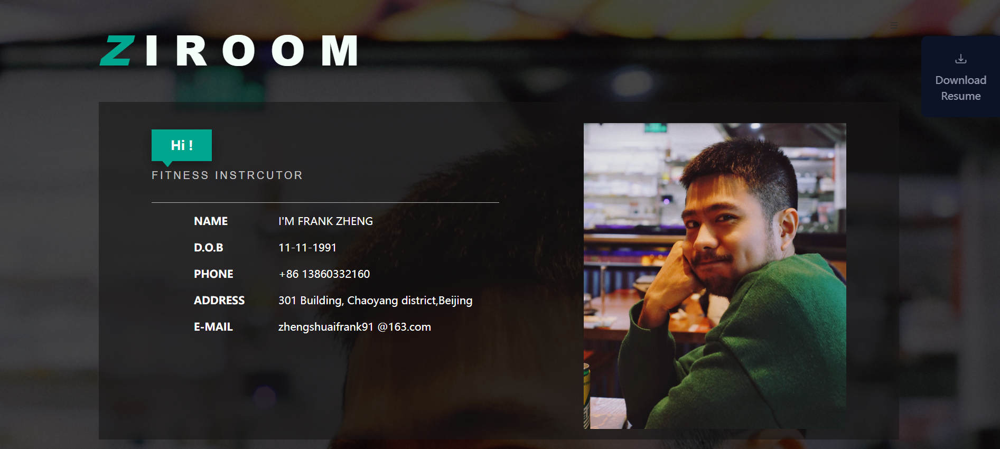
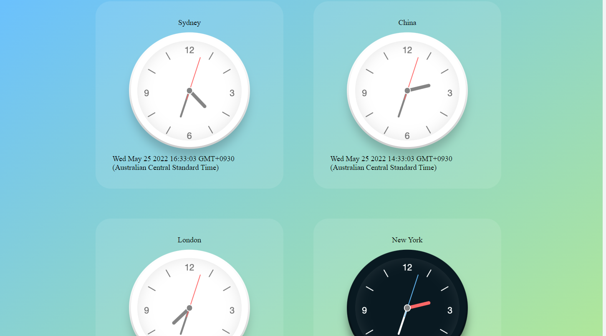

# jiantao-projects
A list of developer's project

## Project 1 - personal website

The purpose of Project One is to make a basic personal/commercial website static website for Stakeholder (Party A). My stakeholder is a personal fitness trainner.
The main purpose is to exercise basic HTML, CSS, JavaScript, as well as Sass, jQuery, Bootstrap, etc. Features such as payments, Schedule appointments, etc. can be added to expand the commercialization of the first project.

Website url: https://shuaizheng-personal-website.netlify.app/

### Webpage layout

## World-Clock Practise

The purpose of this practise is using React to create four world clocks displaying time in four different timezones: Sydney, China, London and New York. The main purpose is to use basic React functional components as well as styled-components dependency to create html DOM components in different forms and can change its style with transformed props.

### Webpage layout

